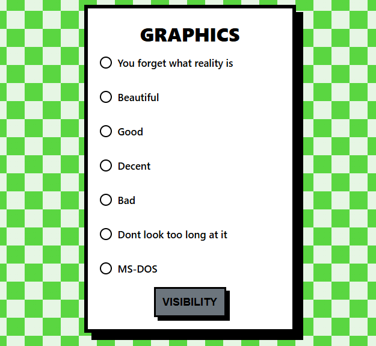

# Steam Review Generator :computer:
An easy-to-use tool that makes creating copypasta steam reviews easier. No long typing and formatting to make the review look good. Simply fill out the form and generate. The generator contains collection of fun options.

## Usage
Simply click the boxes you want and generate
```
---{ Gameplay }---

☐ Very good
☑ Good
☐ It's just gameplay
☐ Mehh
☐ Watch paint dry instead
☐ Just don't
```
Dont want to rate certain category? Simply use the visibility button and hide unwanted category.<br>
<br>


## Built with
* [](#)
* [](#)
* [](#)

## Contributing
Project is open source and contributions are welcome. <br>
If you like this project, dont forget to give it a star! :star:


